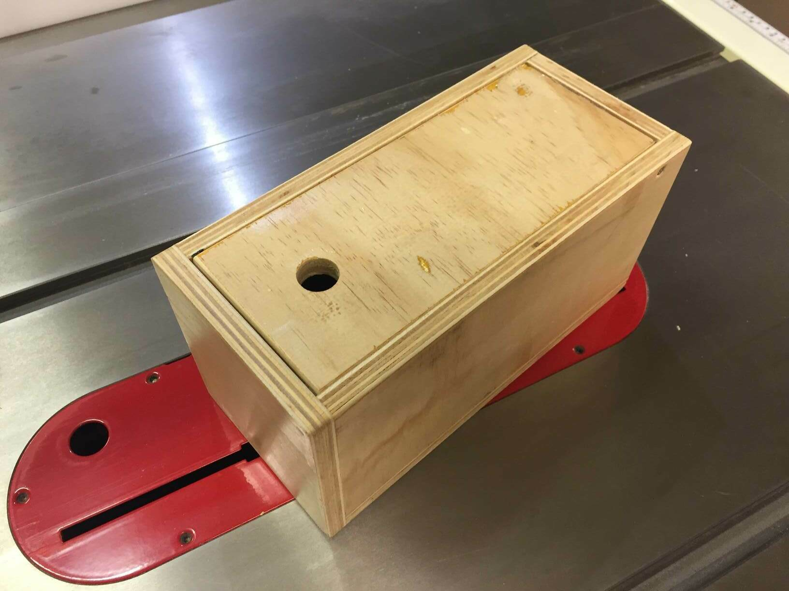

# Pensil Box

# Notes

12mm scrap-bin plywood pensil-holder box.

240x110x120mm 12mm plywood. Lid is hinged at back, finger hole at front, ledge
lid cather glued in at front. Coated with satin water-based polyutherane.
